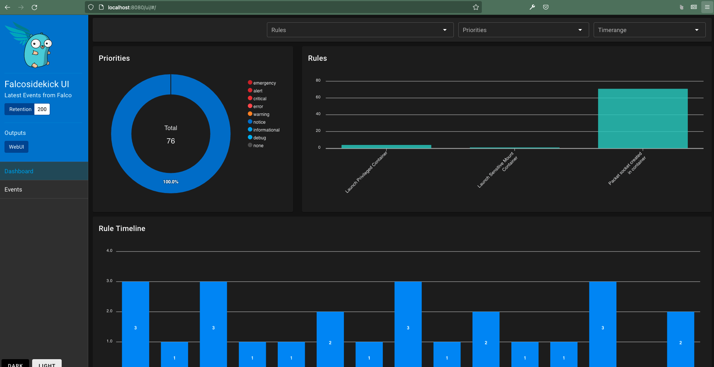

# DigitalOcean-Kubernetes-Challenge - 2021

DigitalOcean launched a [Kubernetes Challenge in 2021](https://www.digitalocean.com/community/pages/kubernetes-challenge). I decided to do the following challenge:
> Deploy a security and compliance system
When you deploy an image you may also deploy a security threat, and images can become quickly insecure as new threats are discovered and disclosed. To continuously monitor and detect threats, you can deploy a tool like [Falco](https://falco.org/).

### What's Falco
Falco uses system calls to secure and monitor a system, by:
* Parsing the Linux system calls from the kernel at runtime
* Asserting the stream against a powerful rules engine
* Alerting when a rule is violated

Falco ships with a default set of rules that check the kernel for unusual behavior such as:
* Privilege escalation using privileged containers
* Namespace changes using tools like setns
* Read/Writes to well-known directories such as /etc, /usr/bin, /usr/sbin, etc
* Creating symlinks
* Ownership and Mode changes
* Unexpected network connections or socket mutations
* Spawned processes using execve
* Executing shell binaries such as sh, bash, csh, zsh, etc
* Executing SSH binaries such as ssh, scp, sftp, etc
* Mutating Linux coreutils executables
* Mutating login binaries
* Mutating shadowutil or passwd executables such as shadowconfig, pwck, chpasswd, getpasswd, change, useradd, etc, and others.

[More info](https://falco.org/docs/)
### Setup
* Install the `doctl` utility to manage DigitalOcean resources via CLI - `brew install doctl`.
* Create an API Key at https://cloud.digitalocean.com/account/api/tokens & authenticate the cli with your API key - `doctl auth init`.
* Create a K8s cluster in region Frankfurt with 2 nodes having 1 GB available RAM & 1 vCPU with
```sh
doctl kubernetes cluster create do-k8s-challenge --region fra1 --size s-1vcpu-2gb --count 2
```
Wait for a few minutes to get the cluster ready.

### Falco deployment
We would deploy the Falco application as as `DaemonSet` on the cluster using the helm-chart:
```sh
# Make sure helm is installed. Add Falco repo
helm repo add falcosecurity https://falcosecurity.github.io/charts
helm repo update

# Install with
helm install falco falcosecurity/falco

# Verify with
helm list
```
### Using FalcoSideKick to look at Falco configuration & events
https://github.com/falcosecurity/falcosidekick-ui
```sh
helm upgrade --set falcosidekick.enabled=true --set falcosidekick.webui.enabled=true falco falcosecurity/falco
``

* Access the UI by forwarding the port
```sh
# Find Falco Sidekick UI pod
kubectl get pods -l app.kubernetes.io/name=falcosidekick-ui -o=name
# Port-forward to access it locally
kubectl port-forward <pod-name-from-previous-step> 8080:2802
```
* Check the UI by visiting http://localhost:8080/ui

Click on `Events` tab on the left column to see the events. Notice the number of events higher than `warning` severity.


### Generate fake events to verify Falco
We can use the [Event-Generator](https://github.com/falcosecurity/event-generator) to generate fake events to verify Falco installation.

Update the helm installation to set `fakeEventGenerator.enabled=true`:
```sh
helm upgrade --set falcosidekick.enabled=true --set falcosidekick.webui.enabled=true --set fakeEventGenerator.enabled=true falco falcosecurity/falco
```
Let it run for a few minute(s) & then disable it:
```sh
helm upgrade --set falcosidekick.enabled=true --set falcosidekick.webui.enabled=true falco falcosecurity/falco
```

We can see in the UI that new `warning` & `error` events were generated.


### References
https://sysdig.com/blog/gke-security-using-falco/